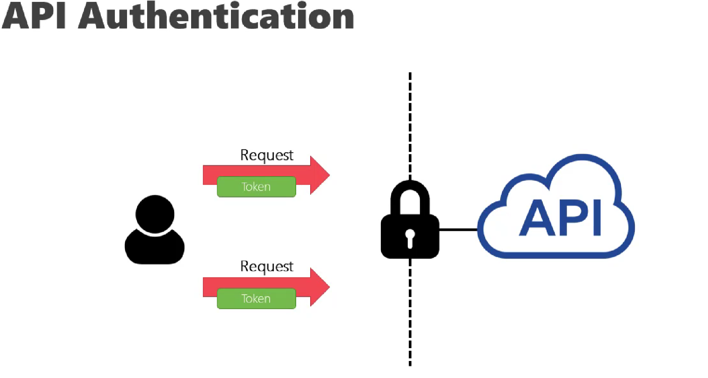

# Laravel | Authentication

Tarih: 14/07/2022
Tip: KonuNotu

Web uygulamalarında bilgi `Session` veya `Cookie` ile tutulurken bunlar üzerinden doğrulama yapılırken 

API uygulamalarında ise her istek ile birlikte `Token` gönderilmesi gerekir.

config/auth.php içeririnde ayarlamalar yapılır. Burada hazır sistemin ayarları bulunur.