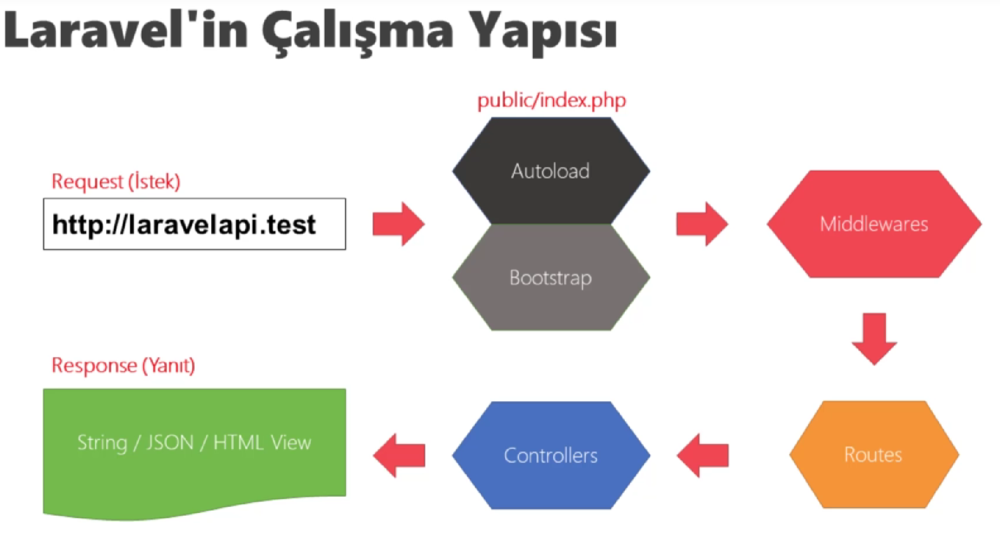

# Laravel | Giriş

Tarih: 24/06/2022
Tip: KonuNotu

<aside>
💡 Dosya yapısı

</aside>

⭐ `app` içinde uygulama kodları bulunur `app/http` içinde `middlewares` ve `controllers` bulunur.

⭐ `Config` içinde uygulamanın farklı ayarları bulunur

⭐ `Database` ise `migration` ve `seeds`lerin bulunduğu veri tabanı işlemleri için

⭐ `public` ise projenin dışarıya açık dosyaları 

⭐ `Resources` `Views` ve `js` gibi klsaörleri içerir

⭐ `Routes` klasörü ise route tanımları web ve api diye ayrılır

⭐ `Storag`e depolanacak dosyalar için

⭐ `Test` test işlemleri için

⭐ `Vendor` gerekli libraryleri bulundurur.

🌟 `.env` proje conf tanımları içerir

🌟 `composer.json` composer ayar ve bağımlılıkları

🌟 `package.json` npm tanımlamaları

🌟 `webpack.mix.js` ise js ve scss dosyalarının derlenip publice aktarımını sağlar

