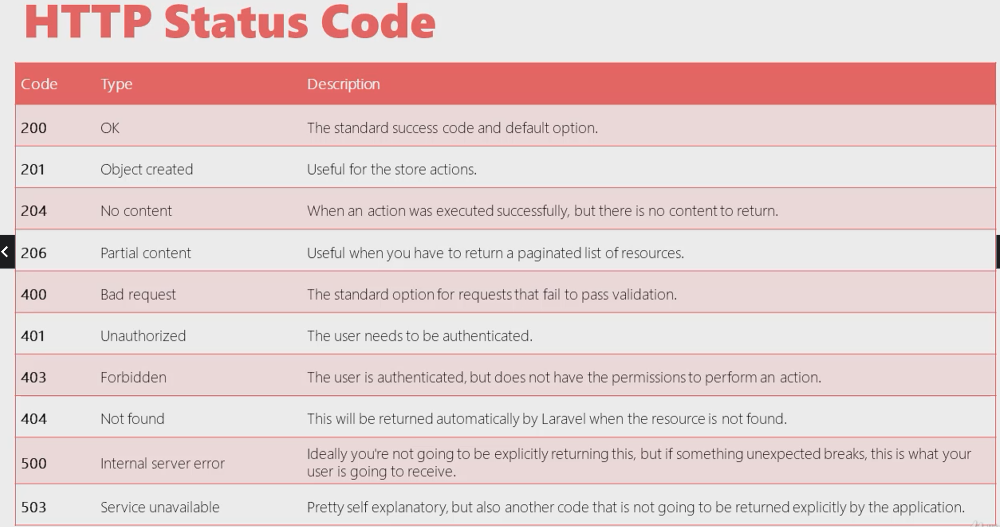

# Laravel-API | Giriş

Tarih: 28/06/2022
Tip: KonuNotu

<aside>
↔️ Method Türleri

</aside>


<aside>
↔️ Durum Kodları

</aside>



<aside>
↔️ Modele göre controller oluşturma crud fonk ile (yapılan işlem api için /web için daha farklı)

</aside>

```php
php artisan make:controller Api\ProductController --api  --model=Product
```

route api içinde oluşturulan controller methodlarının tamamını kapsar

```php
Route::resource('/products',ProductController::class);
```

```php
PS C:\Users\sedat\Desktop\GithubRepo\PHP\LaravelProjects\first-app> php artisan route:list

  GET|HEAD        / ............................................................................................................................... 
  POST            _ignition/execute-solution ........................ ignition.executeSolution › Spatie\LaravelIgnition › ExecuteSolutionController
  GET|HEAD        _ignition/health-check .................................... ignition.healthCheck › Spatie\LaravelIgnition › HealthCheckController
  POST            _ignition/update-config ................................. ignition.updateConfig › Spatie\LaravelIgnition › UpdateConfigController
  GET|HEAD        api/hello ....................................................................................................................... 
  GET|HEAD        api/products ........................................................................... products.index › ProductController@index
  POST            api/products ........................................................................... products.store › ProductController@store
  GET|HEAD        api/products/create .................................................................. products.create › ProductController@create
  GET|HEAD        api/products/{product} ................................................................... products.show › ProductController@show
  PUT|PATCH       api/products/{product} ............................................................... products.update › ProductController@update
  DELETE          api/products/{product} ............................................................. products.destroy › ProductController@destroy
  GET|HEAD        api/products/{product}/edit .............................................................. products.edit › ProductController@edit
  GET|HEAD        api/user ........................................................................................................................ 
  GET|HEAD        api/users ....................................................................................................................... 
  GET|HEAD        basics/category/{id} .............................................................................................. category.show
  GET|HEAD        basics/categorygetir ............................................................................................................ 
  GET|HEAD        basics/merhaba .................................................................................................................. 
  GET|HEAD        basics/merhaba-json ............................................................................................................. 
  GET|HEAD        basics/merhaba-json2 ............................................................................................................ 
  GET|HEAD        basics/merhaba-json3 ............................................................................................................ 
  GET|HEAD        basics/product/{id?} ............................................................................................................ 
  GET|HEAD        product/{id?} ............................................................................................ ProductController@show
  GET|HEAD        sanctum/csrf-cookie ................................................................. Laravel\Sanctum › CsrfCookieController@show
```