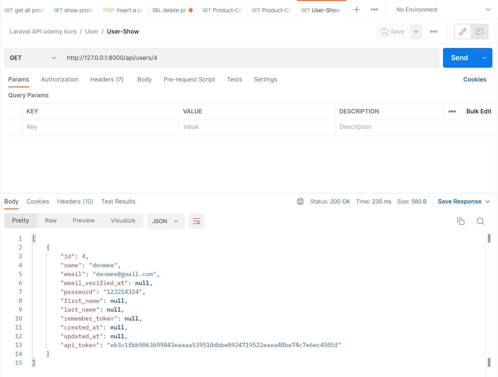
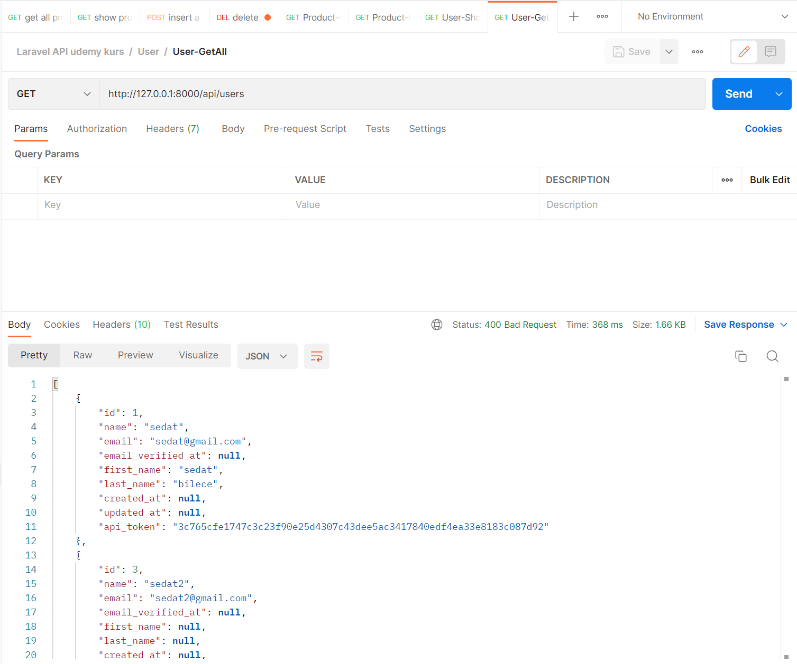
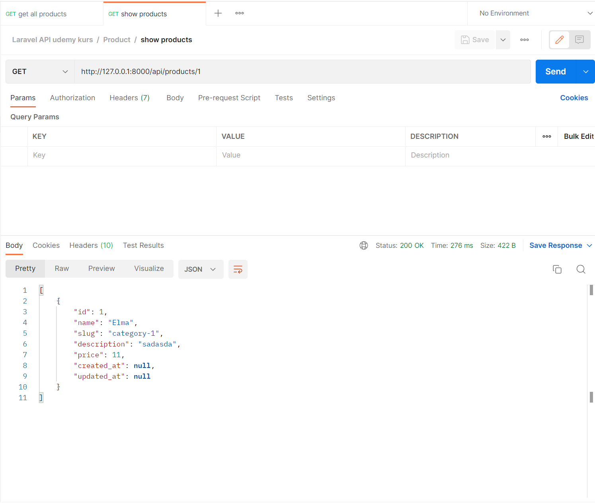
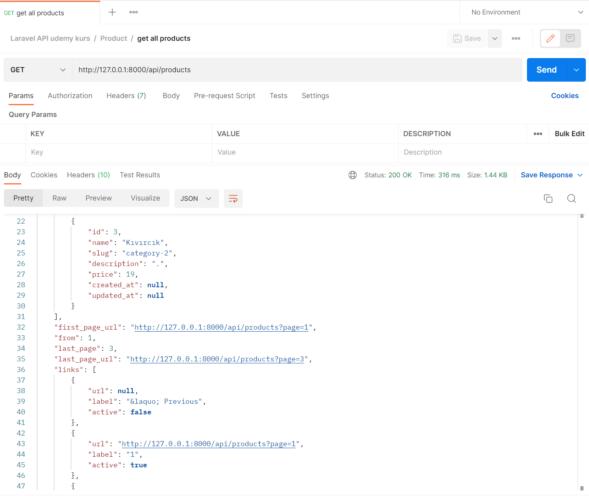
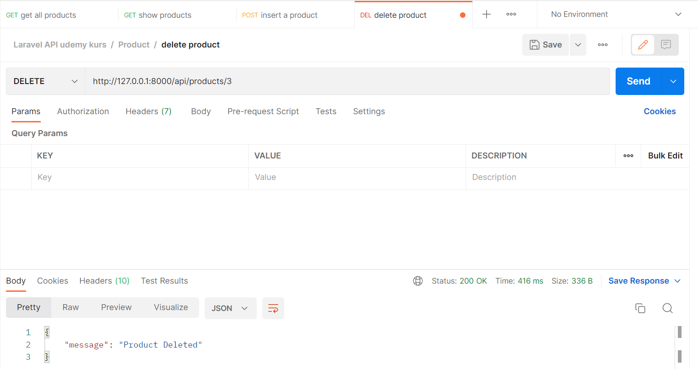
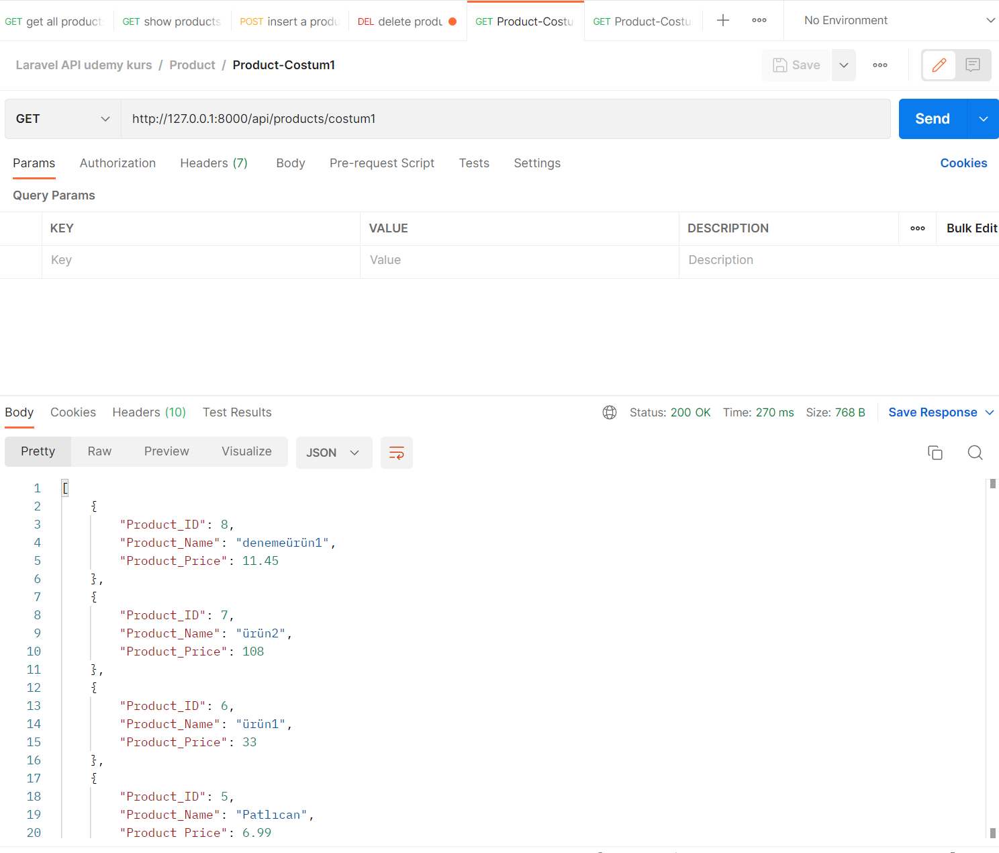

<h1> PHP-Laravel 9 Restfull API  </h1>

## Description
An api has been created that performs basic operations on Laravel using the projection restfull api requirements.
 
 

### Screenshots

 

 

## My Notes (REST API Desing Rulebook)

<ul>
       <li> 
       <a href='./images/Notes/ch2.md'> CH2 - Identifier Design with URLs </a>
       </li>
       <li> 
       <a href='./images/Notes/ch3.md'> CH3 - Interaction Design with HTTP </a>
       </li>
       <li> 
       <a href='./images/Notes/ch4.md'> CH4 - Metadata Design </a>
       </li>
       <li> 
       <a href='./images/Notes/ch5.md'> CH5 - Representation Design </a>
       </li>
       
</ul>
