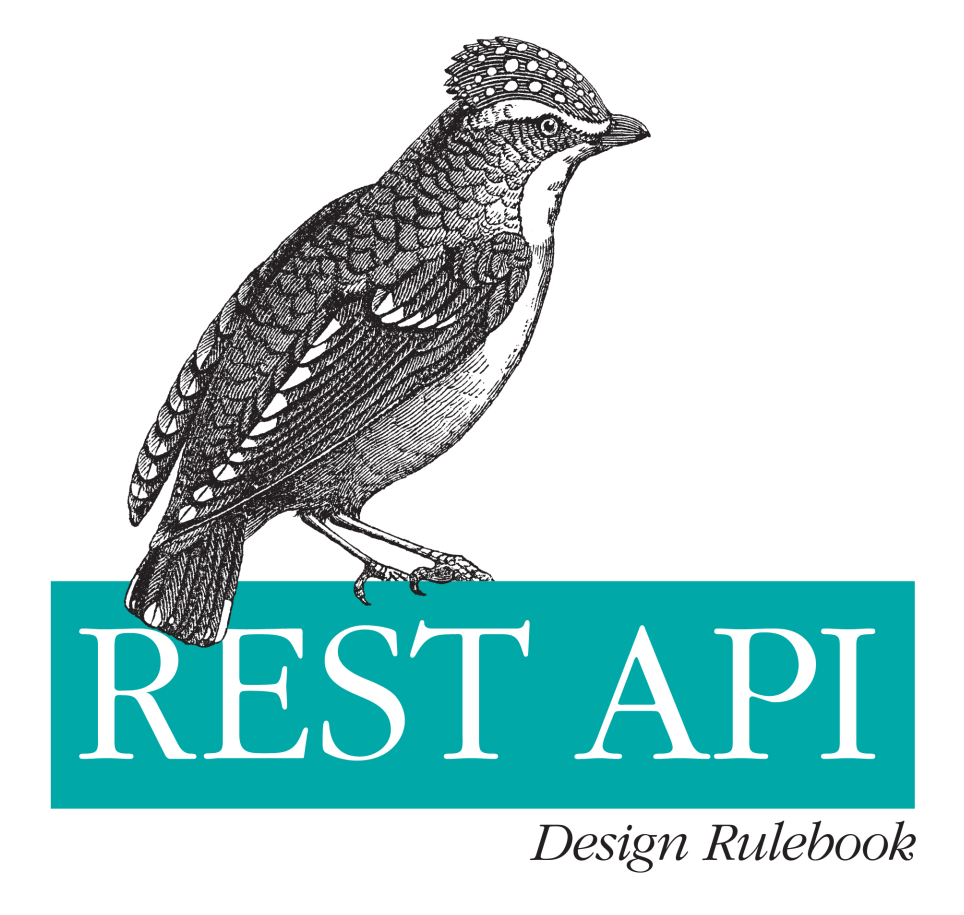

# REST API Desing Rulebook - CH3 - Interaction Design with HTTP

Tarih: 02/07/2022
Tip: KonuNotu



HTTP/1.1 3 temel öğe içerir :

Request Methods

Response Codes 

Message Headers

# Request Methods

Daha fazla olmakla birlikte 4 temel method içermektedir .

1. GET
2. POST
3. PUT
4. DELETE

<aside>
📏 KURAL :  GET ve POST transparan olmalıdır kötüye kullanımı engellemek için

</aside>

<aside>
📏 KURAL : GET kaynak dönebilmelidir

</aside>

burada dönülen data header ve body den oluşur.

```bash
curl -v http://api.example.restapi.org/greeting 

/* HEADER*/
> GET /greeting HTTP/1.1 
> User-Agent: curl/7.20.1 
> Host: api.example.restapi.org
> Accept: */*

< HTTP/1.1 200 OK 
< Date: Sat, 20 Aug 2011 16:02:40 GMT 
< Server: Apache
< Expires: Sat, 20 Aug 2011 16:03:40 GMT
< Cache-Control: max-age=60, must-revalidate
< ETag: text/html:hello world
< Content-Length: 130
< Last-Modified: Sat, 20 Aug 2011 16:02:17 GMT
< Vary: Accept-Encoding
< Content-Type: text/html

/* BODY */
<!doctype html><head><meta charset="utf-8"><title>Greeting</title></head> 
<body><div id="greeting">Hello World!</div></body></html>
```

<aside>
📏 KURAL : HEAD sadece header dönmeli body dönmez

</aside>

<aside>
📏 KURAL : PUT insert ve update fonksiyonlarını karşılamalıdır.

</aside>

put bu iki fonksiyonda verilen veri yok ise oluşturmalı var ise update yapabilmelidir.

PUT /accounts/4ef2d5d0-cb7e-11e0-9572-0800200c9a66/buckets/objects/4321 ✅

<aside>
📏 KURAL : POST insert haricinde controllerı işletebilmelidir

</aside>

CRUD işlemleri dışındaki işlemler için en uygun method POST methodudur .

Burada POST ile Controllerdaki farklı işlemlerin desteklenmesi gereklidir.

örneğin :  mail gönderimi veya tekrar alert gönderimi bu işlemlerde herhangi bir crud yok iken Controlerın tetiklenmesi gerekli

POST /alerts/245743/resend ✅

<aside>
📏 KURAL : DELETE veriyi tamamen kaldırmak için kullanılmalıdır

</aside>

soft delete gibi işlemler için  kullanılmamalıdır. İstenen veri bulunamaz ise 404 döndürmelidir.

DELETE /accounts/4ef2d5d0-cb7e-11e0-9572-0800200c9a66/buckets/objects/4321 ✅

<aside>
📏 KURAL : OPTIONS desteklenmelidir.

</aside>

OPTIONS methodu API’ın hangi methodları desteklediğini döndürmelidir.

```json
{
'Allow': GET, PUT, DELETE
}
```

# Response Status Codes

1xx: İletişim isteği
2xx: Başarılı durumlar
3xx: Yönlendirme veya Taşıma
4xx: Client Hataları
5xx: Server Hataları

<aside>
📏 KURAL : 200 : Ok

</aside>

başarılı işlemlerde dönülür

<aside>
📏 KURAL : 201 : Created

</aside>

Yeni kaynak oluşturulduğunda başarı durumu için dönülür

<aside>
📏 KURAL : 202 : Accepted

</aside>

isteğin kabul edildiğni döndürür FAKAT isteğin durumunu garanti etmez olumsuzda olabilir 

<aside>
📏 KURAL : 204 : No Content

</aside>

Başarılı durumlarda dönülebilir Eğer body döndürülmüyor ise kullanılmalı

<aside>
📏 KURAL :  301 : Moved Permanently

</aside>

İstek kaynağının bulunamadı kalıcı olarak taşındığı durumlarda dönülür

<aside>
📏 KURAL : 303 : See Other

</aside>

Farklı bir url’e yönlendirme veya get isteği atılması istendiğinde dönülür.

<aside>
📏 KURAL : 304 : Not Modified

</aside>

Boş body dönülüyorsa kullanılabilir farkı ise örn cahce ile db değişiklik yoktur 

 

<aside>
📏 KURAL : 307 : Temporary Redirect

</aside>

Geçici taşıma vb durumlarda kullanılır 302’Den farkı http method değiştirmez

<aside>
📏 KURAL :  400 : Bad Request

</aside>

istek işlenemez ise dönülür

<aside>
📏 KURAL : 401 : Unauthorized

</aside>

Kimlik doğrulaması sağlanamaz ise örn: kullanıcı girişi yapılmadan user login  özellikli bir fonk kullanılmak istenirse

<aside>
📏 KURAL : 403 : Forbidden

</aside>

Erişim yasak diye geçer , Role level gibi kullanıcı giriş yapmış fakat admin fonksiyonuna erişim isterse 

<aside>
📏 KURAL :  404 : Not Found

</aside>

itek kaynağı bulunamaz ise dönülür

<aside>
📏 KURAL :  405 : Method Not Allowed

</aside>

önceden bahsedilen API’ın desteklediği methodlar haricindeki method kullanılırsa dönülür.

<aside>
📏 KURAL :  406 : Not Acceptable

</aside>

Client serverın kabul ettiği media tiplerine uymayan veri gönderimi veya isteği yapar ise

örn :

application/xml ❌

application/json ✅

<aside>
📏 KURAL :  409 : Conflict

</aside>

Çakışma durumunda dönülür

 örn : Olmayan bir verinin silinmeye çalışılması gibi

<aside>
📏 KURAL :  500 : Internal Server Error

</aside>

Sunucu kaynaklı hatalar 

Genelde çoğu framework kendisi otomatik döner ve exception fırlatır