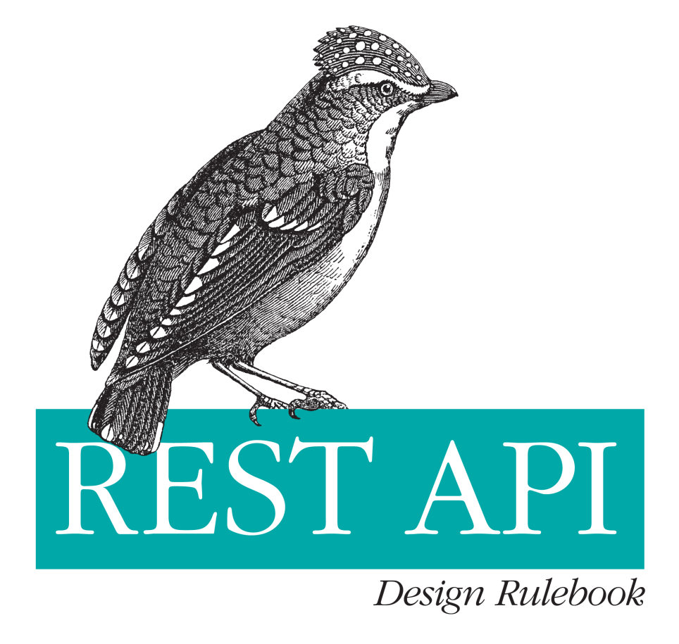

# REST API Desing Rulebook - CH4 - Metadata Design

Tarih: 05/07/2022
Tip: KonuNotu

# HTTP Headers

<aside>
📏 KURAL : Content-Type olmalı

</aside>

dönen header içerisinde media type olmalıdır.

<aside>
📏 KURAL : Content-Length olmalı

</aside>

Mesaj ve header ayrımı gibi işlemler için header ve message length verilmelidir .

<aside>
📏 KURAL : Last-Modified olmalı

</aside>

timestamp(zaman damgası) olmalı bu sayede caching sağlanır . Bu gelişmiş çoğu framework’ün model yapısında vardır.

<aside>
📏 KURAL : ETag response’da kullanılmalı

</aside>

Caching işlemi için verinin gönderilip gönderilmeyeceği bu tag’e bakılarak belirlenir

<aside>
📏 KURAL :Store 2 türlüde PUT methodunu desteklemelidir.

</aside>

hiç nesne yoksa eklenmeli 201 created dönülmeli

var ise 409 conflict dönülmeli

aktifse 200 ok veya 204 dönülmelidir.

Burada hangi işlemin yapılacağına modified ve match gibi değişkenlerle bakılabilir

<aside>
📏 KURAL : Location yeni kaynak oluşturabilmeli

</aside>

Sayfa yönlendirme ile alakalı yeni url oluşturabilmeli

<aside>
📏 KURAL :Cache yapısı teşvik edilmeli

</aside>

yüklenme , gecikme , cdns , client network load gibi konularda avantaj sağlar .

<aside>
📏 KURAL : Expires header olmalı

</aside>

Mesajın sonlanma tarihi olmalı loadingi önlemek için

<aside>
📏 KURAL :yüklenme , gecikme , cdns , client netwrk load ayarlanabilir olmalı

</aside>

# Media Types

farklı şekilleri vardır

- application
- audio
- image
- message
- model
- multipart
- text
- video

API için en çok kullanılan tipi application’dır application/json formatlı veri geri dönülür genelde